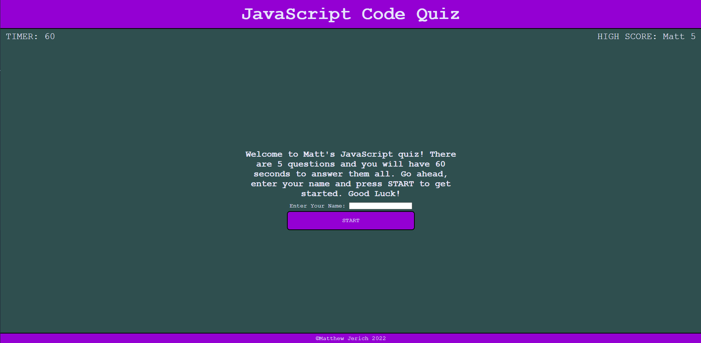

# Web APIs Challenge: Code Quiz

## This is the Fourth challenge for my MSU bootcamp.

I had to create a quiz on the fundamentals of JavaScript, with the following criteria:
```
GIVEN I am taking a code quiz
WHEN I click the start button
THEN a timer starts and I am presented with a question
WHEN I answer a question
THEN I am presented with another question
WHEN I answer a question incorrectly
THEN time is subtracted from the clock
WHEN all questions are answered or the timer reaches 0
THEN the game is over
WHEN the game is over
THEN I can save my initials and score
```



Application URL: https://mjerich.com/code-quiz/
